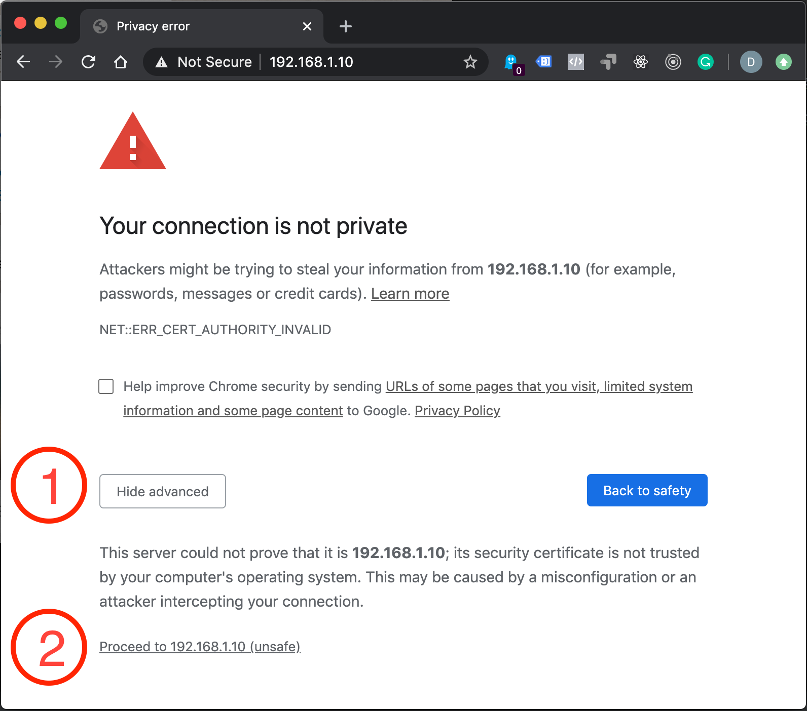
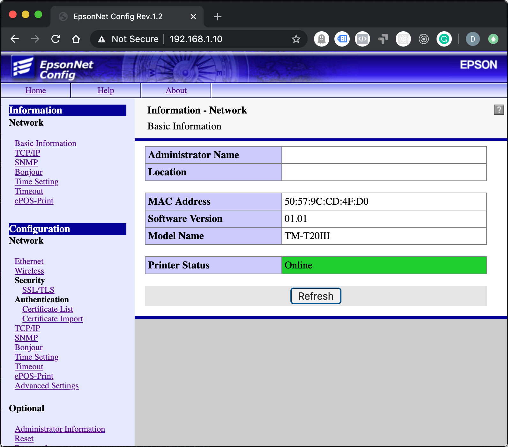
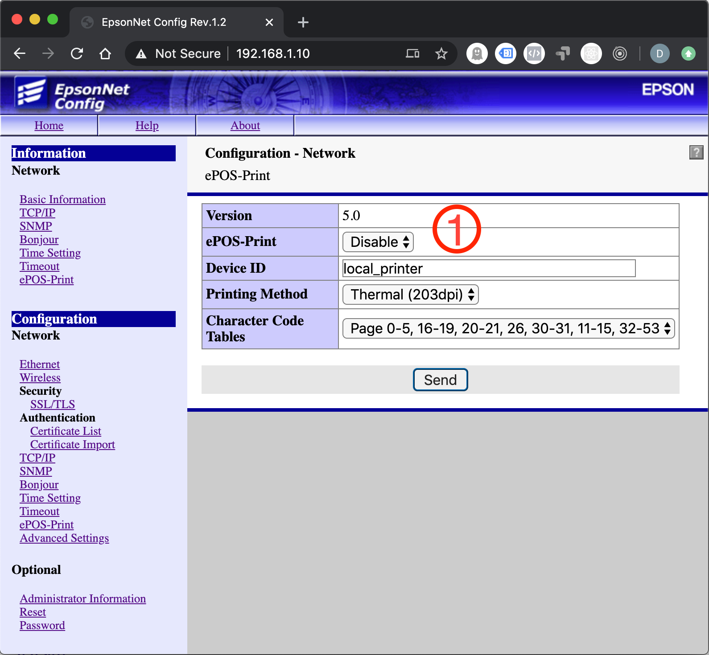
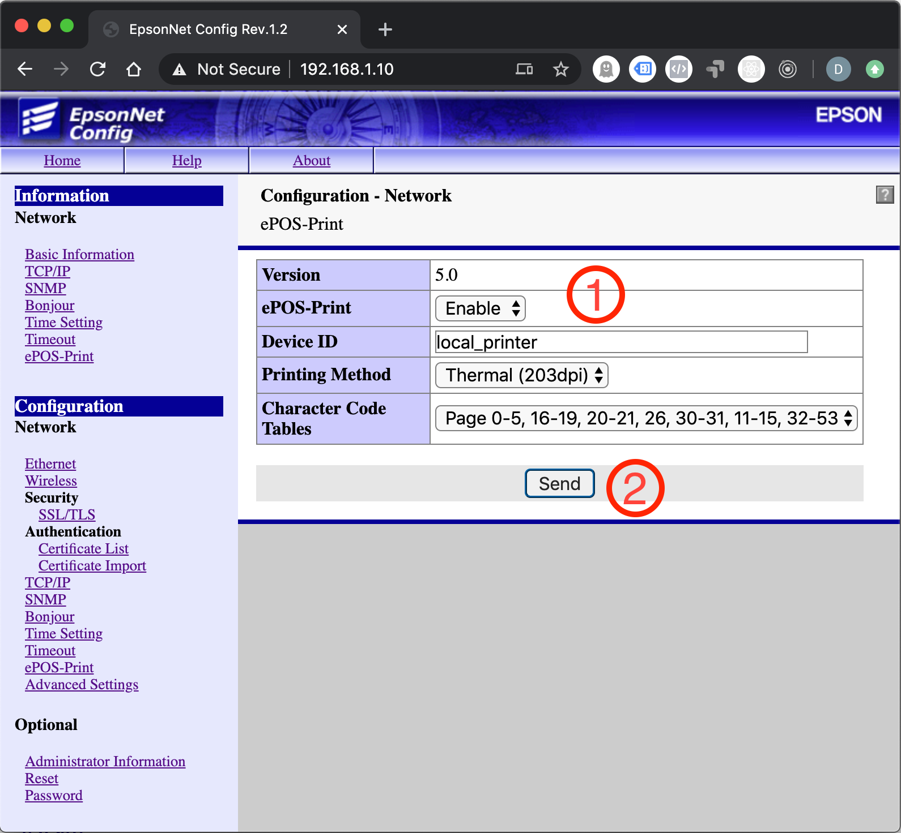
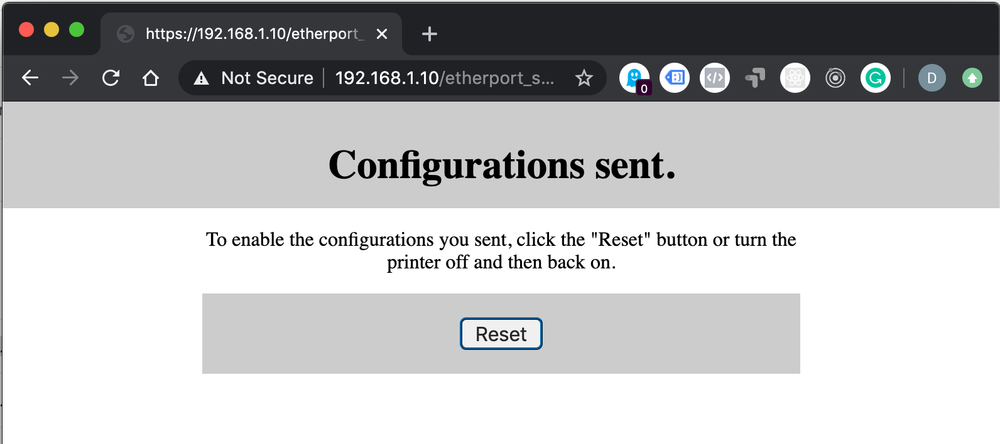
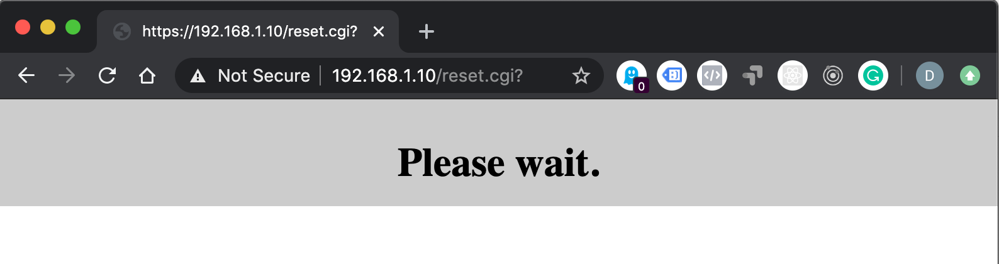
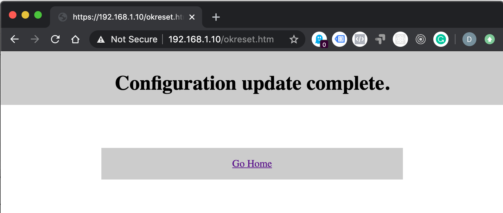
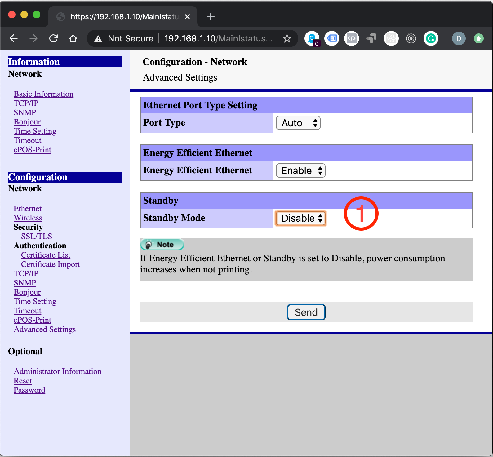

# Preparazione di una nuova stampante per Deliverart

Per poter stampare con Deliverart bisogna abilitare alcune funzionalità della stampante.

## IP della stampante

La prima cosa da fare è cercare l'IP della stampante, supponiamo che l'IP sia **192.168.1.10**.
Fatta questa operazione, possiamo collegarci tramite un browser, ad esempio Chrome, all'indirizzo IP della stampante come segue: [https://192.168.1.10/](https://192.168.1.10/).

## Certificato

La stampante ha un certificato di sicurezza interno che non viene riconosciuto dal browser, questo significa che dobbiamo prima accettarlo per poter contunuare.

Le operazione da fare sono:

- Cliccare su Avanzate (1 nel cerchio rosso)
- Cliccare su procedi su 192.168.1.10 (2 sul cerchio rosso)

## Accedere alla configurazione

Una volta accettato il certificato la stampante ci chiederà le credenziali di accesso.

Utilizzare quelle di default di Epson:

- Username: epson
- Password: epson

Una volta entrati avrete un pannello di controllo con questa interfaccia:

Sulla sinistra ci sono due menù, in alto la parte informativa: **Information**, più in basso, la parte delle impostazioni: **Configuration**.

A questo punto dobbiamo completare due settaggi, il primo è abilitare le API della stampante, il secondo è disabilitare lo Stand by mode della stessa.

## Abilitare le API della stampante

Dal menù di sinistra, sotto la voce in basso **Configuration** cliccare su **ePOS-Print**, comparirà una schermata come questa sotto.

Modificare il valore di ePOS-Print *(1 nel cerchio rosso)* da **Disable** a **Enable**, vedi figura sotto:

Cliccare ora su **Send** *(2 nel cerchio rosso)*. Comparirà una schermata come la seguente:

Cliccare ora su **Reset**. Comparirà una schermata come la seguente, attendi un minuto circa:

Una volta finito comparirà la schermata di esito come quella in basso, cliccare su **Go Home**

## Disabilitare lo Stand by Mode

Dal menù di sinistra, sotto la voce in basso **Configuration** cliccare su **Advanced Settings**, si aprirà questa schermata.

Modificare la voce **Standby Mode** da **Enable** a **Disable** (1 nel cerchio rosso), cliccare poi su **Send** e comparirà una schermata come le precendenti:

Cliccare ora su **Reset**. Comparirà una schermata come la seguente, attendi un minuto circa:

Una volta finito comparirà la schermata di esito come quella in basso, cliccare su **Go Home**

Abbiamo, finito, puoi chiudere la finestra del browser e iniziare a stampare scontrini con Deliverart.

Grazie